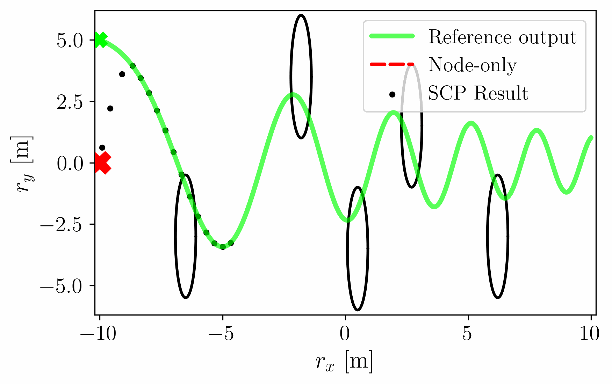
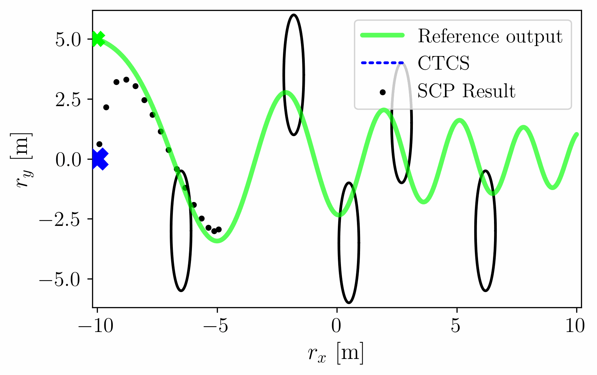

### Successive Convexification for Nonlinear Model Predictive Control with Continuous-Time Constraint Satisfaction

#### Node-only


#### Continuous-time Constraint Satisfaction


#### Comparison


### Preprint

```
@article{uzun2024successive,
  title={Successive convexification for nonlinear model predictive control with continuous-time constraint satisfaction},
  author={Uzun, Samet and Elango, Purnanand and Kamath, Abhinav G and Kim, Taewan and A{\c{c}}{\i}kme{\c{s}}e, Beh{\c{c}}et},
  journal={IFAC-PapersOnLine},
  volume={58},
  number={18},
  pages={421--429},
  year={2024},
  publisher={Elsevier},
  url={https://doi.org/10.1016/j.ifacol.2024.09.062}
}
```
